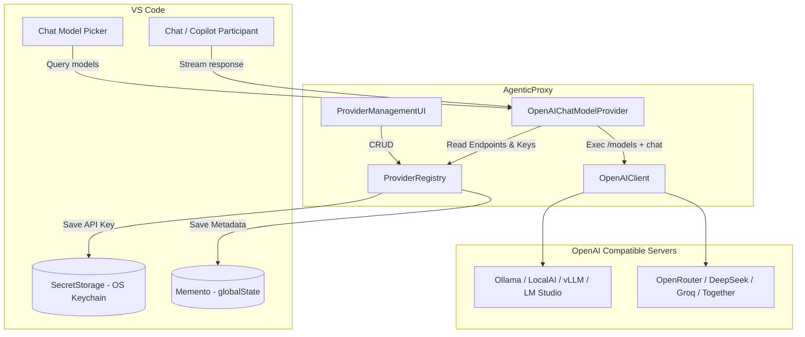

# AgenticProxy — Development Guide

Everything you need to develop, build, test, and publish **AgenticProxy**. For user-facing docs (install, usage, settings), see [README.md](README.md).

---

## 🏗 Architecture & Data Flow

The extension separates **secure storage** (keys), **metadata storage** (provider config), the **providers registry**, and the **OpenAI client**:



### How a request flows

1. **Discovery** — Chat's model picker calls `provideLanguageModelChatInformation`. AgenticProxy fetches `/models` from every provider **in parallel** (`Promise.allSettled`), so one unreachable endpoint never blocks the others.
2. **Namespacing** — Each result is namespaced as `<providerId>::<modelId>`, the reason the same raw model name from two different providers can coexist in one picker.
3. **Chat** — When a message is sent, `provideLanguageModelChatResponse` translates the VS Code request into an OpenAI `chat/completions` payload (roles, images, tools, `temperature`/`top_p`/`max_tokens`), streams the SSE response, and emits text deltas — reassembling fragmented `tool_calls` into `LanguageModelToolCallPart`s as they arrive.

### Data storage

| Data | Store | Keyed by |
| --- | --- | --- |
| Provider configs (nickname, URL, custom models, discovered models) | `context.globalState` (Memento) | `agenticproxy.providers` + provider UUID |
| API keys | `context.secrets` (SecretStorage / OS keychain) | `apiKey::<providerId>` |

Provider configs and API keys persist across extension **updates** as long as `publisher` and `name` in `package.json` are unchanged (VS Code keys storage by that identity). Changing either orphans existing user data.

---

## 📂 Source Layout

```
src/
├── extension.ts               # activation, commands & view registration
├── provider.ts                 # LanguageModelChatProvider implementation
├── types.ts                    # shared model types (ProviderEntry, OpenAI messages…)
├── services/
│   ├── modelMapper.ts          # VS Code <-> OpenAI payload mapping, namespacing
│   ├── openaiClient.ts         # fetch /models, SSE streaming, error handling
│   └── providerRegistry.ts     # CRUD over Memento + SecretStorage
└── ui/
    ├── providerManagement.ts   # QuickPick management flows
    ├── providerForm.ts         # persistent WebView form (nickname/URL/key)
    └── providerSidebar.ts      # activity-bar WebView "Providers" view
```

---

## 🛠 Dev Commands

| Command | Purpose |
| --- | --- |
| `npm install` | Install dependencies. |
| `npm run compile` | Build to `dist/` (dev, with sourcemaps). |
| `npm run watch` | Watch mode for development (used by F5 launch). |
| `npm run typecheck` | Type-check the sources (`tsc --noEmit`). |
| `npm run lint` | ESLint (flat config, `eslint.config.js`). |
| `npm run package` | Production bundle. |
| `npm run vsce:package` | Build + produce the `.vsix` for publishing. |
| `npm run vsce:publish` | Publish to the marketplace. |

Run `F5` (or **Run Extension** in the Debug view) to launch an Extension Development Host. The launch config wires up `preLaunchTask: npm: watch` automatically.

### Taskfile

The repo ships a [`Taskfile.yml`](Taskfile.yml), managed with the [`task`](https://taskfile.dev) binary from [go-task/task](https://github.com/go-task/task). It wraps the npm scripts above into handy, dependency-aware commands.

**Install `task` on your platform:**

| Platform | Command |
| --- | --- |
| **macOS** (Homebrew) | `brew install go-task/tap/go-task` |
| **Linux** (Homebrew) | `brew install go-task/tap/go-task` |
| **Linux** (Snap) | `sudo snap install task --classic` |
| **Windows** (Chocolatey) | `choco install go-task` |
| **Windows** (Scoop) | `scoop install task` |
| **Any** (Go) | `go install github.com/go-task/task/v3/cmd/task@latest` |

> Prebuilt binaries (`.deb`/`.rpm`/Windows) are also available on the [GitHub releases page](https://github.com/go-task/task/releases).

| Task | What it runs | Description |
| --- | --- | --- |
| `task` (or `task default`) | `task --list` | Show all available tasks. |
| `task install` | `npm install` | Install dependencies. |
| `task compile` | `npm run compile` | Dev build to `dist/` (with sourcemaps). |
| `task watch` | `npm run watch` | Watch mode + rebuild (used by F5). |
| `task build` | `npm run package` | Production bundle. |
| `task typecheck` | `npm run typecheck` | Type-check (`tsc --noEmit`). |
| `task lint` | `npm run lint` | ESLint on `src`. |
| `task check` | `typecheck` → `lint` | Run both quality gates in order. |
| `task package` | `build` → `vsce:package` | **Build then produce the `.vsix`.** |
| `task publish` | `build` → `vsce:publish` | Build then publish to the marketplace (requires login). |
| `task clean` | `rm -rf dist *.vsix` | Remove build artifacts. |
| `task dev` | — | Prints the "press F5" hint. |

Because they use `deps:`/task ordering, `task package` and `task publish` rebuild first — you never have to remember to run `build` manually. `task check` is the fast "did I break anything?" one-liner.

> **Note:** every Taskfile task is a thin wrapper over the `npm run` scripts above — there's no extra logic hiding in it. If you don't have the `task` binary installed (or prefer not to install it), run the equivalent npm command from the table above instead; nothing else changes.

### Quality gates

Before proposing changes (or a release):

```sh
# npm equivalent
npm run typecheck
npm run lint
npm run package   # last check that the bundle + vsce packaging work

# or with Taskfile
task check
task package
```

---

## 📦 Publishing

Package metadata (publisher, version, icon, license, engines, categories) lives in `package.json`. The marketplace uses `README.md` (user docs) and `CHANGELOG.md` (release notes) from the repo root.

1. **Bump the version** in `package.json` and add a `CHANGELOG.md` entry (Keep a Changelog + SemVer).
2. **One-time login** to Azure DevOps with your publisher (`zoranmax`):

   ```sh
   npx vsce login zoranmax
   ```

   To create a Personal Access Token, visit `https://dev.azure.com/<org>/_usersSettings/tokens` with the **Marketplace → Manage** scope.

3. **Publish**:

   ```sh
   npm run vsce:publish
   ```

   (Both `vsce:package` and `vsce:publish` pass `--no-dependencies` — the bundle is pre-built by the `vscode:prepublish` script.)

### What gets shipped

Packaging is driven by `.vscodeignore` (do **not** add a `files` array in `package.json`, since `vsce` rejects the combination). `esbuild.js` bundles `src/extension.ts` → `dist/extension.js` (CJS, `external: ['vscode']`), and all source/TS/dev files are excluded from the VSIX.

---

## 📝 Contributing

- Keep API keys out of issues, PRs, and examples.
- Run the quality gates above before opening a PR.
- The changelog is written in the repo root `CHANGELOG.md`-format at the root of the repo.